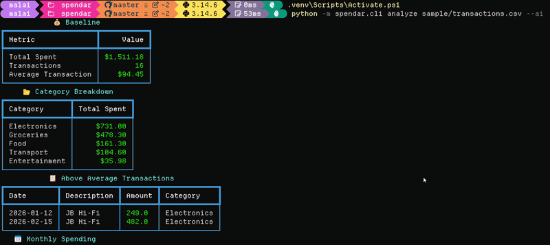

<div align="center">

# 💸 Spendar 💸 

### Your spending, actually explained.

**A CLI that tells you where your money went — without sounding like a bank statement.**

Spendar takes a CSV of transactions and turns raw financial data into clear, useful insights — from spending breakdowns and monthly trends to anomaly detection, duplicate charges and AI-generated summaries.

All from your terminal. In seconds.

 </br>


---

## ✨ What Spendar does

Spendar combines traditional data analysis with an optional AI layer to turn transaction data into something that's actually easy to understand.

|    | Feature                 | What it does                                                    |
| -- | ------------------------ | ----------------------------------------------------------------- |
| 📊 | **Spending metrics**    | Total spent, transaction count, and average transaction         |
| 📂 | **Category breakdown**  | See exactly where your money is going                           |
| 📅 | **Monthly trends**      | Compare spending month-over-month                               |
| 🚨 | **Anomaly detection**   | Flag transactions significantly larger than your usual spending |
| 🔁 | **Duplicate detection** | Catch potential accidental double-charges                       |
| 🤖 | **AI summary**          | Get a plain-English explanation of your spending                |
| 🎨 | **Rich terminal UI**    | Structured, colourized output instead of a wall of text         |

---

## 🧠 Why I built this

Spendar started as a sandbox.

I'm building **[Paydar](https://github.com/MiikaA1i/paydar)**, a full-stack personal finance application, and I wanted to figure out how AI-generated financial insights should actually work **before** wiring them into a larger, more complex codebase.

Rather than experimenting directly inside Paydar, I built something smaller.

Spendar became my testbed for:

🧠 Prompt design · 🔌 LLM API integration · 🛡️ Error handling · 📊 Real-world data analysis · 🐼 Working with pandas · 🖥️ Building a clean CLI with Typer · 🤖 Understanding where AI genuinely adds value

The idea was simple:

> **Experiment small → learn quickly → bring the good ideas into Paydar.**

So while Spendar is its own project, it also represents one step in the development of Paydar's AI features.

---

## 🔄 How it works

```text
                 CSV
                  │
                  ▼
        ┌──────────────────┐
        │   Load & Clean   │
        │     CSV Data     │
        └────────┬─────────┘
                 │
                 ▼
        ┌──────────────────┐
        │     pandas       │
        │     Analysis     │
        └────────┬─────────┘
                 │
        ┌────────┼─────────┐
        ▼        ▼         ▼
     Metrics   Trends   Detection
        │        │         │
        └────────┼─────────┘
                 │
                 ▼
        ┌──────────────────┐
        │    Rich CLI      │
        │     Report       │
        └────────┬─────────┘
                 │
              --ai
                 │
                 ▼
        ┌──────────────────┐
        │  Google Gemini   │
        │  AI Summary      │
        └──────────────────┘
```

The core analysis works independently from AI.

Using `--ai` adds an optional Gemini-powered interpretation layer on top of the calculated results.

---

## 🚀 Quick start

### 1. Clone

```bash
git clone https://github.com/MiikaA1i/spendar.git
cd spendar
```

### 2. Create a virtual environment

**Windows**

```bash
python -m venv .venv
.venv\Scripts\activate
```

**macOS / Linux**

```bash
python -m venv .venv
source .venv/bin/activate
```

### 3. Install

```bash
pip install -e .
```

### 4. Analyze the sample data

```bash
python -m spendar.cli analyze sample/transactions.csv
```

---

## 🤖 Enable AI insights

Spendar works without an API key.

To enable the AI-generated summary, create a `.env` file:

```env
GEMINI_API_KEY=your_key_here
```

Then run:

```bash
python -m spendar.cli analyze sample/transactions.csv --ai
```

Get a Gemini API key from [Google AI Studio](https://aistudio.google.com/).

### Why make AI optional?

The analysis itself shouldn't depend on an LLM.

Spendar calculates the underlying metrics locally, while Gemini is used as an additional interpretation layer.

That separation makes the application:

Faster when AI isn't needed · More predictable · Easier to test · More useful without an API key · Safer to experiment with

---

## 📁 Use your own data

Spendar expects a CSV containing:

```csv
date,amount,category,description
2026-01-03,24.50,Food,Lunch
2026-01-05,65.00,Transport,Fuel
2026-01-07,120.00,Entertainment,Concert
```

### Required columns

| Column        | Description             |
| ------------- | ------------------------ |
| `date`        | Transaction date        |
| `amount`      | Transaction amount      |
| `category`    | Spending category       |
| `description` | Transaction description |

Then:

```bash
python -m spendar.cli analyze path/to/transactions.csv
```

---

## 🧪 Testing

Run the test suite with:

```bash
pytest tests/ -v
```

Current coverage includes:

CSV loading · Core spending metrics · Category calculations · Anomaly detection

---

## 🛠️ Tech stack

| Technology               | Purpose                           |
| ------------------------- | ----------------------------------- |
| 🐍 **Python**            | Application logic                 |
| 🐼 **pandas**            | Data analysis and transformations |
| ⚡ **Typer**              | Command-line interface            |
| 🎨 **Rich**              | Terminal UI and formatting        |
| 🤖 **Google Gemini API** | AI-generated insights             |
| 🧪 **pytest**            | Automated testing                 |
| 🔐 **python-dotenv**     | Environment configuration         |

---

## 🔐 Privacy

Spendar's core analysis runs locally.

The `--ai` flag is optional. When enabled, data used to generate the AI summary is sent to Google's Gemini API.

**Don't use real financial data with the AI feature unless you're comfortable with Google's current API and data-handling terms.**

The included sample dataset is provided specifically for safe experimentation.

Also, never commit your API key:

```gitignore
.env
.venv/
__pycache__/
```

---

## 🗺️ Roadmap

**📈 Analysis** — More advanced anomaly detection · Custom spending thresholds · Improved trend analysis · Multiple currency support

**💰 Finance** — Budget tracking · Savings goals · Recurring transaction detection

**📤 Export** — PDF reports · CSV reports · JSON output

**🌐 Future** — Web dashboard companion · Deeper AI insights · Integration with Paydar

---

## 💡 What I learned

Spendar gave me hands-on experience with something I couldn't really learn by just following another tutorial:

**How do you actually add AI to an existing application without making it feel pointless?**

Along the way I worked with:

```text
Python
  ├── pandas
  ├── Typer
  ├── Rich
  └── pytest

AI
  ├── Gemini API
  ├── Prompt design
  ├── Structured context
  └── Error handling

Software Engineering
  ├── CLI architecture
  ├── Data validation
  ├── Testing
  └── Separation of concerns
```

The biggest takeaway was that **AI works best when it sits on top of good application logic**, rather than replacing it.

---

## 🔗 Spendar → Paydar

Spendar is intentionally smaller than Paydar.

That's the point.

```text
              SPENDAR
                 │
                 ▼
          AI experimentation
                 │
                 ▼
        LLM + data analysis
                 │
                 ▼
          Lessons learned
                 │
                 ▼
              PAYDAR
                 │
                 ▼
       Larger finance platform
```

Spendar gave me a low-risk environment to experiment, break things, iterate, and understand AI integration before applying those lessons to a much larger application.

---

##⋆. 𐙚˚࿔ Built by Miika 𝜗𝜚˚⋆

[GitHub](https://github.com/MiikaA1i) · [LinkedIn](https://linkedin.com/in/malaika-ali-183229298)

---

Built with 🐍 Python, 📊 pandas & 🤖 curiosity.

</div>
